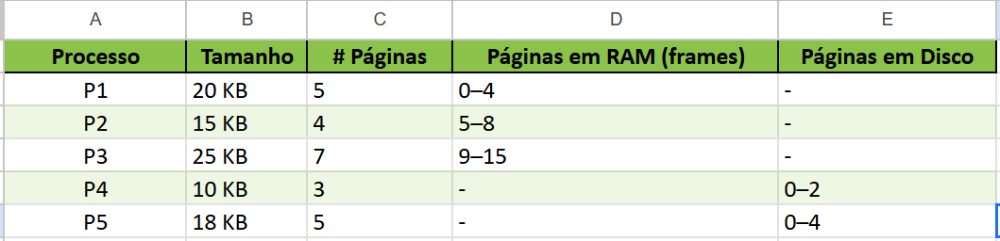

# S.O. 2025.1 - Atividade 2.02 - Gestão de memória

## Informações gerais

- **Objetivo do repositório**: Repositório para atividade avaliativa dos alunos
- **Assunto**: Gestão de memória
- **Público alvo**: alunos da disciplina de SO (Sistemas Operacionais) do curso de TADS (Superior em Tecnologia em Análise e Desenvolvimento de Sistemas) no CNAT-IFRN (Instituto Federal de Educação, Ciência e Tecnologia do Rio Grande do Norte - Campus Natal-Central).
- disciplina: **SO** [Sistemas Operacionais](https://github.com/sistemas-operacionais/)
- professor: [Leonardo A. Minora](https://github.com/leonardo-minora)
- Repositótio do aluno: [Nadson Santos Nascimento](https://github.com/nadsuus)

## Tarefas do aluno
1. Fork desse repositório e atualizar a linha 10 com o nome e link do github
2. Ler a descrição da atividade
3. Montar a resposta no final deste arqivo, no tópico **Resposta**

---

## 1. Descrição da atividade
### 1.1. Objetivo
Praticar os conceitos de alocação de memória (best-fit), memória virtual e desfragmentação em um sistema com memória limitada.

---

### 1.2. Contexto
Um computador possui apenas **64 KB de RAM** e um **disco rígido para memória virtual**. O sistema operacional deve gerenciar 5 processos com tamanhos diferentes, cuja soma ultrapassa a capacidade da RAM.

#### 1.2.1. Processos iniciais

| Processo | Tamanho (KB) |
|----------|-------------|
| P1       | 20          |
| P2       | 15          |
| P3       | 25          |
| P4       | 10          |
| P5       | 18          |
| **Total**| **88 KB**   |

- **Memória RAM**: 64 KB (contígua, inicialmente vazia).  
- **Memória Virtual (Disco)**: Espaço ilimitado para paginação.

#### 1.2.2. Alocação Inicial com Best-Fit
Os alunos devem simular a alocação dos processos na RAM usando o algoritmo **best-fit**.  
- A memória RAM será representada como um bloco contíguo (ex: `[0KB - 64KB]`).  
- Devem alocar os processos nos menores espaços livres que atendam ao seu tamanho.  

**Alocação inicial**:  
1. P1 (20 KB) → Ocupa [0-20].  
2. P2 (15 KB) → Ocupa [20-15].  
3. _continuar a partir daqui_

#### 1.2.3. Simular Memória Virtual (Paginação)
- Os processos não alocados na RAM devem ser "paginados" no disco.  
- Criar uma tabela de páginas indicando quais partes estão na RAM e quais estão no disco.  

#### 1.2.4. Desfragmentação da RAM
- Desfragmentar a RAM para liberar espaço contíguo.
- Após desfragmentação (compactação), verificar quais processos podem ser alocado.  

### 1.3. Questões para Reflexão
1. Best-fit foi mais eficiente que first-fit ou worst-fit neste cenário?  
2. Como a memória virtual evitou um deadlock?  
3. Qual o impacto da desfragmentação no desempenho do sistema?  

---

## Resposta

### 1. Alocação Inicial com Best-Fit

| Etapa | Processo | Bloco livre escolhido | Intervalo (KB) | Blocos livres resultantes |
|:-----:|:--------:|:---------------------:|:--------------:|:-------------------------:|
|   1   | P1 (20)  | [0–64]                | [0–20]         | [20–64] (44 KB)           |
|   2   | P2 (15)  | [20–64]               | [20–35]        | [35–64] (29 KB)           |
|   3   | P3 (25)  | [35–64]               | [35–60]        | [60–64] (4 KB)            |
|   4   | P4 (10)  | [60–64] (4 KB < 10 KB) | não cabe → disco | [60–64] (4 KB)         |
|   5   | P5 (18)  | [60–64] (4 KB < 18 KB) | não cabe → disco | [60–64] (4 KB)         |

- **Alocados em RAM**:  
  • P1 → [0–20]  
  • P2 → [20–35]  
  • P3 → [35–60]  
- **Paginação em disco**:  
  • P4, P5

---

### 2. Simular Memória Virtual (Paginação)

Assumindo **tamanho de página = 4 KB** (64 KB de RAM → 16 frames: 0–15):

| Processo | Tamanho | # Páginas | Páginas em RAM (frames) | Páginas em Disco |
|:--------:|:-------:|:---------:|:-----------------------:|:----------------:|
|   P1     | 20 KB   | 5         | 0–4                     | –                |
|   P2     | 15 KB   | 4         | 5–8                     | –                |
|   P3     | 25 KB   | 7         | 9–15                    | –                |
|   P4     | 10 KB   | 3         | –                       | 0–2              |
|   P5     | 18 KB   | 5         | –                       | 0–4              |

- RAM totalmente ocupada por P1, P2 e P3.
- P4 e P5 ficam com todas suas páginas em disco.

---

### 3. Desfragmentação da RAM

**Antes da compactação**

[P1:0–20] [P2:20–35] [P3:35–60] [ Livre: 60–64 ]

- Há apenas um bloco livre de 4 KB no final; não há fragmentação externa em meio aos processos.

**Após a compactação**  
[P1:0–20] [P2:20–35] [P3:35–60] [ Livre: 60–64 ]

- O layout não se altera, pois os blocos já estão contíguos.
- O espaço livre de 4 KB continua insuficiente para alocar P4 (10 KB) ou P5 (18 KB).

---

### 4. Questões para Reflexão

1. **Best-fit foi mais eficiente que first-fit ou worst-fit?**  
   Neste cenário, como só havia um bloco livre até a chegada de P3, todos os algoritmos (best-, first- e worst-fit) alocaram P1, P2 e P3 nos mesmos endereços, e P4/P5 foram para disco. Logo, não houve ganho prático de espaço nem redução de fragmentação. Em geral, o best-fit gera blocos remanescentes menores (bom para poupar um pouco de espaço), mas pode aumentar a fragmentação externa e é mais lento na busca; o first-fit é mais rápido e tende a fragmentar menos externamente; o worst-fit preserva grandes blocos, adiando a fragmentação mas desperdiçando mais espaço no curto prazo.

2. **Como a memória virtual evitou um deadlock?**  
   A paginação separa o espaço de endereço lógico do físico. Processos podem rodar mesmo sem ter todo o seu segmento contíguo em RAM, carregando páginas sob demanda e liberando outras. Isso quebra a condição de “espera circular” por blocos contíguos grandes, pois o SO pode trocar páginas entre RAM e disco, evitando que processos fiquem bloqueados indefinidamente.

3. **Qual o impacto da desfragmentação no desempenho do sistema?**  
   A compactação consolida blocos livres, mas implica movimentar segmentos ou copiar páginas na memória, gerando overhead de CPU e I/O. Se feita com frequência em sistemas em produção, pode degradar muito o desempenho. Por isso, em sistemas modernos, prefere-se paging/virtualização a desfragmentação externa frequente.